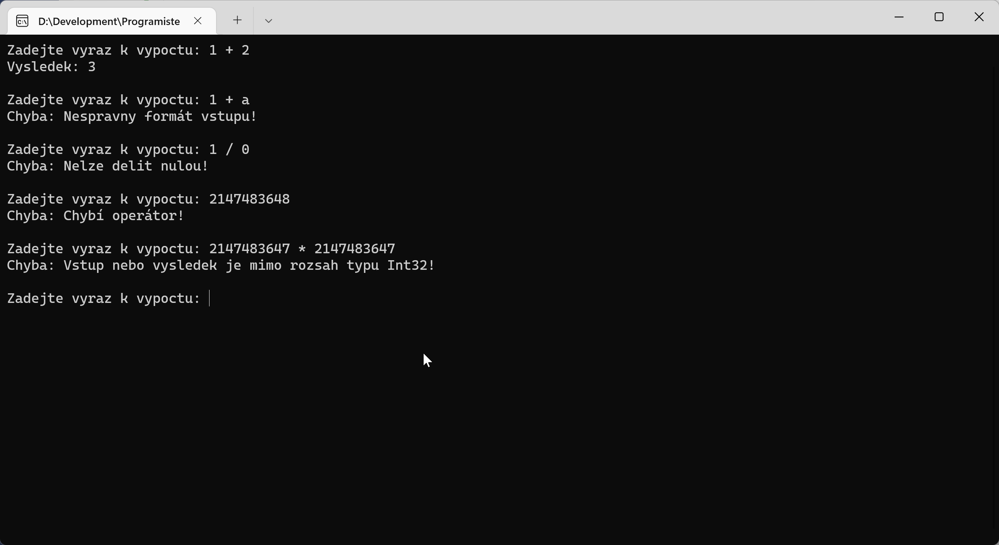

# ExceptionHandlingCalculator - Kalkulátor se zpracováním výjimek

## Výjimky
*Výjimky* (**exceptions**) slouží v .NET i dalších programovacích platformách k signalizaci a zpracování chybových či jinak výjimečných stavů.

Říkáme, že program *vyhazuje výjimku* (**throws** exception), pokud v nějaké jeho části nastává situace, která je výjimkou signalizována (např. dělení nulou, nesprávný formát čísel, nedostatek paměti, atp.).

Výjimky můžeme zpracovávat ("ošetřovat") pomocí konstrukce `try-catch`. Blokem `try` obalíme část kódu, kde může výjimka nastat, nasleduje blok `catch`, v kterém můžeme na výjimku reagovat, tzv. ji zpracovat:
```csharp
try
{
	result = num1 / num2;
}
catch (DivideByZeroException ex)
{
	Console.WriteLine("Dělení nulou není dovoleno.");
}
```
Pokud výjimku nezpracujeme, program je ukončen s chybovým výpisem.

Bloků `catch` můžeme mít za sebou více a zachytávat tak více různých výjimek.

### Vlastní výjimky
Můžeme též vytvářet a vyhazovat vlastní výjimky. Dědíme z třídy `Exception` a používáme klíčové slovo `throw`:
```csharp
public class MyException : Exception
{
	...
}
if (some_error_conditions)
{
	throw new MyException("Exception message");
}
```

Více o výjimkách si nastudujte v dokumentaci .NET (celkem ~13min čtení):
* [Přehled](https://docs.microsoft.com/cs-cz/dotnet/csharp/fundamentals/exceptions/)
* [Použití výjimek](https://docs.microsoft.com/cs-cz/dotnet/csharp/fundamentals/exceptions/using-exceptions)
* [Ošetření výjimek](https://docs.microsoft.com/cs-cz/dotnet/csharp/fundamentals/exceptions/exception-handling)
* [Vytváření a vyvolání výjimek](https://docs.microsoft.com/cs-cz/dotnet/csharp/fundamentals/exceptions/creating-and-throwing-exceptions)
* [Výjimky generované kompilátorem](https://docs.microsoft.com/cs-cz/dotnet/csharp/fundamentals/exceptions/compiler-generated-exceptions)

## Zadání
Vytvořte miniaplikaci, která bude jednoduchým kalkulátorem se základními operacemi (+, -, *, /) nad dvěma čísly (vstupem bude např. textový řetězec `3 + 2`). Smyslem však tentokrát není vytvořit dokonalý výpočet, ale **ošetřit co nejvíce chybových stavů**, vysvětlit uživateli chybu a vyžádat od něj korekci, například:
* dělení nulou `3 / 0`
* nesprávný formát čísla `3 / jedna`
* nesprávný formát vstupu `31 21`, `31 + 23 12`
* nezpracovatelné číslo (rozsahem) `123456789012345678901234567890 - 10`
* výsledek mimo rozsah `2147483647 * 2147483647`
* prázdný vstup
* atp.

Pokuste se alespoň jeden z chybových stavů detekovat vlastní kontrolou a signalizovat vlastní výjimkou, např. nesprávný formát vstupu.



## Inspirace
```csharp
while (true)
{
	Console.Write("Zadejte výraz k výpočtu: ");
	string input = Console.ReadLine();

	try
	{
		int result = Calculate(input);
		Console.WriteLine($"Výsledek: {result}");
	}
	catch (DivideByZeroException)
	{
		Console.WriteLine("Chyba: Nelze dělit nulou!");
	}
	catch (FormatException)
	{
		Console.WriteLine("Chyba: Nespravný formát vstupu!");
	}
	catch (OverflowException)
	{
		Console.WriteLine("Chyba: Vstup nebo výsledek je mimo rozsah typu Int32!");
	}
	catch (MyMissingOperatorException ex)
	{
		Console.WriteLine($"Chyba: {ex.Message}");
	}
	catch (Exception ex)
	{
		Console.WriteLine($"Chyba: {ex.Message}");
	}
}

int Calculate(string input)
{
	if (input.Contains("/"))
	{
		string[] parts = input.Split('/');
		int left = int.Parse(parts[0]);
		int right = int.Parse(parts[1]);
		return left / right;
	}
	else if (input.Contains("*"))
	{
		string[] parts = input.Split('*');
		int left = int.Parse(parts[0]);
		int right = int.Parse(parts[1]);
		return left * right;
	}
	else if (input.Contains("+"))
	{
		string[] parts = input.Split('+');
		int left = int.Parse(parts[0]);
		int right = int.Parse(parts[1]);
		return left + right;
	}
	else if (input.Contains("-"))
	{
		string[] parts = input.Split('-');
		int left = int.Parse(parts[0]);
		int right = int.Parse(parts[1]);
		return left - right;
	}

	throw new MyMissingOperatorException("Chybí operátor!");
}

public class MyMissingOperatorException : Exception
{
	public MyMissingOperatorException() : base() { }
	public MyMissingOperatorException(string message) : base(message) { }
}
```


## Rozšíření
Další informace a cvičení si můžete projít například v CodinGame:
* https://www.codingame.com/playgrounds/12322/c-professional---basics-oop---exercises/exception-handling
* https://www.codingame.com/playgrounds/12322/c-professional---basics-oop---exercises/exception-handling---exercises


